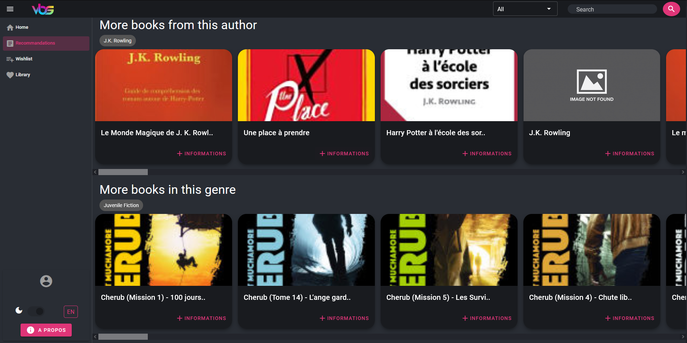

<div id="top"></div>
<!--
*** Thanks for checking out the Best-README-Template. If you have a suggestion
*** that would make this better, please fork the repo and create a pull request
*** or simply open an issue with the tag "enhancement".
*** Don't forget to give the project a star!
*** Thanks again! Now go create something AMAZING! :D
-->


<!-- PROJECT SHIELDS -->
<!--
*** I'm using markdown "reference style" links for readability.
*** Reference links are enclosed in brackets [ ] instead of parentheses ( ).
*** See the bottom of this document for the declaration of the reference variables
*** for contributors-url, forks-url, etc. This is an optional, concise syntax you may use.
*** https://www.markdownguide.org/basic-syntax/#reference-style-links
-->
[![repo-size][repo-size-shield]][repo-size-url]
[![License][license-shield]][license-url]


<!-- PROJECT LOGO -->
<br />
<div align="center">
  <a href="https://github.com/othneildrew/Best-README-Template">
    
  </a>

  <h3 align="center">Vue Book Suggestion :book:</h3>

  <p align="center">
    Have recommendations based on what you have already read !
    <br />
    <a href="https://vue-book-suggestion.netlify.app/#/"><strong>Go to VBS »</strong></a>
  </p>
</div>


<!-- TABLE OF CONTENTS -->
<!-- <details>
  <summary>Table of Contents</summary>
  <ol>
    <li>
      <a href="#about-the-project">About The Project</a>
      <ul>
        <li><a href="#built-with">Built With</a></li>
      </ul>
    </li>
    <li>
      <a href="#getting-started">Getting Started</a>
      <ul>
        <li><a href="#prerequisites">Prerequisites</a></li>
        <li><a href="#installation">Installation</a></li>
      </ul>
    </li>
    <li><a href="#usage">Usage</a></li>
    <li><a href="#roadmap">Roadmap</a></li>
    <li><a href="#contributing">Contributing</a></li>
    <li><a href="#license">License</a></li>
    <li><a href="#contact">Contact</a></li>
    <li><a href="#acknowledgments">Acknowledgments</a></li>
  </ol>
</details> -->


<!-- ABOUT THE PROJECT -->
## About The Project
 Have recommendations based on what you have already read !


<p align="right">(<a href="#top">back to top</a>)</p>


### Built With
* [Vue.js](https://vuejs.org/)
* [Vuetify](https://vuetifyjs.com/en/)
* [Google book api](https://developers.google.com/books/docs/v1/using)

<p align="right">(<a href="#top">back to top</a>)</p>


<!-- GETTING STARTED -->
## Getting Started
To get a local copy up and running follow these simple steps.
### Prerequisites

Have ```node``` installed.

### Installation

1. Clone the repo
   ```sh
   git clone https://github.com/Didiloy/VBS.git
   ```
2. Navigate to the directory named vbs
     ```sh
    cd VBS/vbs
     ```
3. Install NPM packages
   ```sh
   npm install
   ```
4. Launch the developpement server
   ```sh
   npm run serve
   ```

<p align="right">(<a href="#top">back to top</a>)</p>


<!-- ROADMAP -->
## TODO

- [ ] mots clés dans la 4eme de couverture
- [ ] inteface mobile
- [ ] sanitize input
- [ ] rentrer soi meme ses mots clés
- [ ] résoudre bug de la recommendation: auteur et genre null
- [ ] add breadcrumb
- [ ] add a back arrow on the informations view

<p align="right">(<a href="#top">back to top</a>)</p>


<!-- CONTRIBUTING -->
## Contributing

Contributions are what make the open source community such an amazing place to learn, inspire, and create. Any contributions you make are **greatly appreciated**.

If you have a suggestion that would make this better, please fork the repo and create a pull request. You can also simply open an issue with the tag "enhancement".
Don't forget to give the project a star! Thanks again!

1. Fork the Project
2. Create your Feature Branch (`git checkout -b feature/AmazingFeature`)
3. Commit your Changes (`git commit -m 'Add some AmazingFeature'`)
4. Push to the Branch (`git push origin feature/AmazingFeature`)
5. Open a Pull Request

<p align="right">(<a href="#top">back to top</a>)</p>


<!-- LICENSE -->
## License

Distributed under the GPLv3 License. See `LICENSE` for more information.

<p align="right">(<a href="#top">back to top</a>)</p>


<!-- MARKDOWN LINKS & IMAGES -->
<!-- https://www.markdownguide.org/basic-syntax/#reference-style-links -->
[repo-size-shield]:https://img.shields.io/github/repo-size/didiloy/vbs
[repo-size-url]: https://github.com/othneildrew/Best-README-Template/graphs/contributors
[license-shield]: https://img.shields.io/badge/Licence-GPLv3-brightgreen
[license-url]: https://www.gnu.org/licenses/gpl-3.0.html

